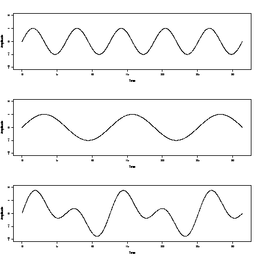
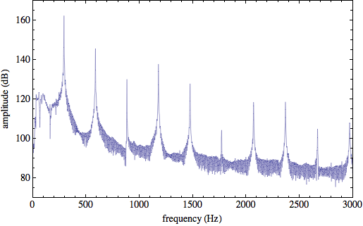

TP 3 : Vectorization et Synthèse Audio
======================================

Le rendu est à envoyer à <pablo.oliveira@prism.uvsq.fr> avec pour sujet "[ASE] TP3 nom1 nom2 ...".

Programmation Vectorielle
-------------------------

(@) Écrire une fonction C qui calcule la somme de deux tableaux de flottants.
    La taille du tableau $N$ doit être paramétrable depuis la ligne de commande. 

(@) Mesurer la performance de votre code grâce à la fonction ci-dessous:

~~~c
#include <time.h>
#include <stdio.h>
unsigned long long read_usec() {
    struct timespec ts;
    unsigned long long t;
    if (clock_gettime(CLOCK_MONOTONIC_RAW, &ts) != 0) {
        perror("Cannot read monotonic clock");
        return 0;
    }

    t = ts.tv_sec*1000000 + ts.tv_nsec/1000;
    return t;
}
~~~ 

Cette fonction vous retourne le nombre de microsecondes écoulées depuis une référence arbitraire.

(@) Écrire une version assembleur qui fait la somme des deux tableaux. Comparer la performance des deux codes.

(@) Puisque l'on traite 8 flottants en parallèle dans la version assembleur, pourquoi n'obtiens t'on pas une accélération de $\times 8$ ?

Synthèse audio 
--------------

### Qu'est ce que le son ?

Le son sont des vibrations de l'air. Un son possède une amplitude: l'intensité de la vibration, et une fréquence: la vitesse de la vibration.
Fourier montre que tout son peut être décomposé en une somme de sinusoïdes plus ou moins intenses. 
Par exemple, le troisième son de la figure 1 peut être obtenu en sommant des deux premiers. 

On appelle cette décomposition en sinusoïdes, le spectre. Le spectre nous donne l'intensité de chaque fréquence. 
Par exemple, la figure ci-dessous montre le spectre de la note Ré sur une guitare classique.

L'intensité la plus forte apparait à la fréquence 293 Hz (fréquence correspondant à un Ré). C'est la fondamentale. 
On voit également des pics apparaître à des multiples de la fondamentale, on les appelle les harmoniques.

L'ensemble des vibrations du spectre sont interprétées par notre oreille comme une note de musique.  
Dans ce TP nous allons générer des sons en réalisant une synthèse additive, c'est à dire nous allons faire une somme de sinusoïdes.

### Génération efficace de sinusoïdes

(@) Utilisation de la fonction $sin$ de la libc. Écrivez un programme qui applique la fonction $sin$ à un tableau de 10000 flottants.
    Quelle est la performance ? La performance dépend-elle des valeurs du tableau ?

Pour accélérer le calcul de sinus, une première idée consiste à précalculer les valeurs de sinus dans une table (look-up table, LUT).

(@) Définissez tout d'abord une constante `LUT_SIZE` qui contiendra la taille de la LUT.

(@) On remarque que la fonction sinus est périodique de période $2.\pi$. Échantillonez `LUT_SIZE` valeurs sur l'intervalle $[0:2\pi]$ et remplissez la LUT.

(@) Écrivez la fonction `float sin_lut(float x)` qui calcule la valeur de sinus en retournant la valeur la plus proche stockée dans la LUT (modulo $2\pi$). 
    Quelle est sa performance ? Quelle est sa précision ? 
    
(@) Améliorez la précision de la LUT en calculant l'interpolation linéaire entre les deux valeurs de la table contenant la valeur $x$ recherchée.

Une deuxième technique pour le calcul de sinus consiste à utiliser une approximation polynomiale. Par exemple, l'approximation de Taylor en $0$ de sinus donne:

$$ sin(x) = x - \frac{x^3}{3!} + \frac{x^5}{5!} - \frac{x^7}{7!} + \ldots $$

cette approximation n'est vrai que près de zéro. 

(@) Écrivez une fonction qui calcule `sin` en utilisant l'approximation en series de taylor à l'ordre 5. Observez comme l'erreur devient grande pour des valeurs éloignées de 0.

En utilisant les propriétés du cercle trigonométrique on peut ramener le calcul de sinus à l'intervalle $[0:\frac{\pi}{2}]$ où l'approximation est précise.

(@) Tout d'abord ramenez vous à l'intervalle $[0:2\pi]$ en utilisant la périodicité de sinus.

(@) Ramenez vous à l'intervalle $[0:\pi]$ en observant l'anti-symétrie de sinus par rapport à l'axe horizontal du cercle trigonométrique ($sin(-x) = -sin(x)$).

(@) Ramenez vous à l'intervalle $[0:\frac{\pi}{2}]$ en exploitant la symétrie verticale du cercle trigonométrique ($sin(\pi-x) = sin(x)$).

(@) Quelle est la précision et la performance de la méthode par approximation polynomiale ?

### Génération de sons

Partez du canevas suivant:

~~~c
#include <unistd.h>
#include <fcntl.h>
#include <sys/types.h>
#include <sys/ioctl.h>
#include <stdlib.h>
#include <stdio.h>
#include <math.h>
#include <linux/soundcard.h>

#define LENGTH 1000		   /* how many ms of speech to store */
#define RATE 44100		   /* the sampling rate */
#define SIZE 16			   /* sample size 16 bits */
#define CHANNELS 1		   /* 1 = mono 2 = stereo */
#define AMPLITUDE 5000     /* base amplitude */

#define nsamples (LENGTH * RATE * CHANNELS / 1000)
#define SINE sin

/* this buffer holds the digitized audio */
unsigned short buf[nsamples];

unsigned int melody[] =
 {392,392,392,311,466,392,311,466,392,587,587,587,622,466,369,311,
  466,392,784,392,392,784,739,698,659,622,659,415,554,523,493,466,
  440,466,311,369,311,392,466,392,466,587,784,392,392,784,739,698,
  659,622,659,415,554,523,493,466,440,466,311,392,311,466,392,311};

int fd;			/* sound device file descriptor */

/* Fill buffer with a pure sinusoid at frequency f */
void pure_sample(int f) {
    int i;
    for (i=0; i < nsamples; i++) {
        buf[i] = (1+SINE(2*M_PI*f/RATE*i))*AMPLITUDE;
    }
}

/* play the audio sample in buf */
void play_sample() {
    int status;			/* return status of system calls */

    status = ioctl (fd, SOUND_PCM_SYNC, 0);
    if (status == -1)
        perror ("SOUND_PCM_SYNC ioctl failed");

    status = write (fd, buf, sizeof (buf));	/* play it back */
    if (status != sizeof (buf))
        perror ("wrote wrong number of bytes");

}

/* initialize the audio DSP device */
void init_dsp_device() {
    int arg;			/* argument for ioctl calls */
    int status;			/* return status of system calls */

    /* open sound device */
    fd = open ("/dev/dsp", O_RDWR);
    if (fd < 0)
    {
        perror ("open of /dev/dsp failed");
        exit (1);
    }

    /* set sampling parameters */
    arg = SIZE;			/* sample size */
    status = ioctl (fd, SOUND_PCM_WRITE_BITS, &arg);
    if (status == -1)
        perror ("SOUND_PCM_WRITE_BITS ioctl failed");
    if (arg != SIZE)
        perror ("unable to set sample size");

    arg = CHANNELS;		/* mono or stereo */
    status = ioctl (fd, SOUND_PCM_WRITE_CHANNELS, &arg);
    if (status == -1)
        perror ("SOUND_PCM_WRITE_CHANNELS ioctl failed");
    if (arg != CHANNELS)
        perror ("unable to set number of channels");

    arg = RATE;			/* sampling rate */
    status = ioctl (fd, SOUND_PCM_WRITE_RATE, &arg);
    if (status == -1)
        perror ("SOUND_PCM_WRITE_WRITE ioctl failed");
}

int main () {
    int i,j;

    init_dsp_device();

    /* Play melody */

    for (i=0; i < sizeof(melody)/sizeof(int); i++) {
        int f = melody[i];
        pure_sample(f);
        play_sample();
    }
}
~~~
     
(@) Analysez le code ci-dessous. Que fait la fonction `init_dsp_device` ?
    Comment envoie t'on un échantillon sonore à la carte son ?
    Quel est le format de représentation audio choisi ?

(@) Testez le code suivant. Pour avoir accès au _device driver_ `/dev/dsp/` il faut exécuter la commande `sudo modprobe snd-pcm-oss`.

Synthèse de différents sons
---------------------------

Le code ci-dessus utilise des fréquences pures (une seule sinusoïde).
Nous souhaitons pouvoir faire varier le type d'instrument utilisé, pour cela nous allons utiliser la synthèse additive.

Nous allons essayer d'obtenir un son de cloche. 
n son de cloche peut être obtenu avec la formule suivante:

$$buf(i) = AMPLITUDE*[sin(0.56f'i) + 0.75sin(0.92f'i)$$
$$+ 0.5sin(1.19f'i) +0.25sin(1.71f'i) + 0.125sin(2f'i)$$
$$+ 0.125sin(2.74f'i) +0.125sin(3f'i) + 0.125sin(3.76f'i)]$$

où $f' = 2\pi\frac{f}{RATE}$.

De manière plus générale un son est défini par ces harmoniques ici: $[0.56, 0.92, 1.19, 1.71, 2, 2.74, 3, 3.76]$ et l'intensité de chaque harmonique ici: 
$[1, .75, .5, .25, .125, .125, .125, .125]$.

(@) Modifiez le programme ci-dessus pour que:
 * le son généré soit une somme de sinus
 * les harmoniques des sinus sont données dans le tableau `float harmonics[8];`
 * les intensités des sinus sont données dane le tablea `float intensities[8];`

(@) Entendez vous le son de cloche ? Essayez de reproduire d'autres sons en changeant les paramètres.

Enveloppe
---------

Pour rendre plus réaliste le son nous allons utiliser une enveloppe. 
L'enveloppe d'un son change au cours du temps. Par exemple une note de piano, à une attaque forte: le son monte rapidement pour atteindre l'amplitude maximale
puis redescent plus doucement pour finalement devenir inaudible.

Nous pouvons simuler un tel comportement en multipliant le tableau de d'échantillons `buf` par une telle enveloppe. 

(@) Modifiez le code ci-dessous pour permettre de multiplier `buf` par une enveloppe. 
(@) Testez différentes formes d'enveloppes. Voici quelques suggestions:

 * Triangle: le son monte avec une pente constante puis redescent avec une pente constante.
 * Sinus: le son fait un effet whawha
 * Parabole: $x^2$

Performance
-----------

Testez la performance de vos différentes implémentation de sinus avec la synthèse audio.

(Bonus) Vectorisez la synthèse audio. 

(@) (Bonus) Le plus simple est de commencer par les sommes et multiplications de vecteurs
(@) (Bonus) En une deuxième phase, la fonction sinus peut être vectorisée. Envoyer un mail à l'encadrant pour des suggestions et des pistes. 
    C'est possible, mais c'est un code assez difficile à écrire. L'encadrant l'a fait en utilisant la technique décrite ici: http://devmaster.net/posts/9648/fast-and-accurate-sine-cosine

  

    

 

