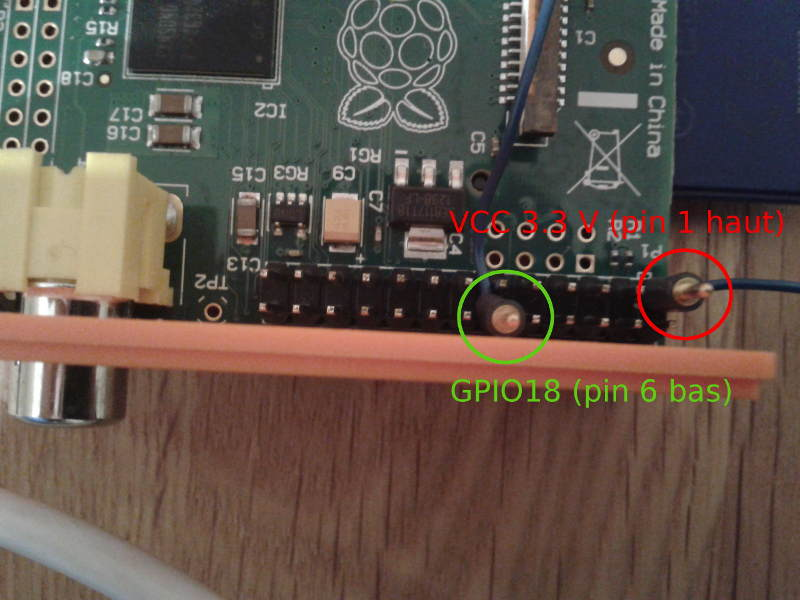

TP 2 : Interruptions et Module Noyau
====================================

Le rendu est à envoyer à <pablo.oliveira@prism.uvsq.fr> avec pour sujet "[ASE] TP1 nom1 nom2 ...".

Réaction à des évènements extérieurs
------------------------------------

Les systèmes embarqués doivent souvent réagir à des évènement extérieurs. Pour
cela ils utilisent différents capteurs (télémètre, accéléromètre, capteur de
pression, caméra, bouton poussoir).

Dans ce TP nous allons étudier l'interfaçage du RaspberryPi avec un capteur
numérique très simple qui peut prendre deux valeurs possibles 1 ou 0.
Ce type de capteurs comprends des boutons poussoirs ou des capteurs de niveau qui
permettent d'éviter le débordement d'une cuve.

Nous supposerons que le capteur est branché sur le GPIO 18.


Préparation
-----------

ATTENTION: si ces instructions ne sont pas suivies correctement vous pouvez rendre
la carte inutilisable.


1. Débranchez tous les connecteurs et retirez la carte SD
2. Ouvrez délicatement le boîtier orange. Ne forcez pas.
2. Branchez deux câbles sur les pins GPIO 18 et VCC 3.3V (aidez vous de la figure 1).




Lecture du capteur par scrutation
---------------------------------

Une première technique pour lire le capteur consiste à lire à intervalles
réguliers l'état du capteur.

Reprenez le code utilisé dans le TP précédent pour écrire sur le GPIO 16 et
modifiez le de manière à lire l'état du GPIO 18.

Il faut configurer le GPIO 18 en mode input. Pour cela, la documentation de la
carte, indique qu'il faut appliquer à l'adresse `(gpio_map+4)` un masque ET avec la
valeur `~(7<<24)` (ce qui revient à mettre à zéro les bits 24, 25 et 26).

La valeur du GPIO 18 peut-être lue en lisant la valeur du 18ème bit du mot à
l'adresse `(gpio_map+52)`.

(@) Écrivez un programme qui lit la valeur du GPIO18. Pour le tester vérifiez que
lorsque vous mettez en contact les deux fils précédemment connectés, la valeur de
GPIO 18 vaut 1.

(@) Modifiez votre programme de manière à ce que chaque fois que vous touchez les
fils la LED s'allume.


Lecture du capteur par interruption
-----------------------------------

La méthode précédente fonctionne mais requiert une scrutation active de l'état du
GPIO. Elle est donc coûteuse en énergie et en temps CPU.

Nous allons maintenant utiliser une méthode par interruption. Néanmoins Linux ne
permet pas de manipuler directement les interruptions matérielles en espace
utilisateur. Nous allons donc devoir implémenter un module noyau simple.

Notre module s'appellera `modtest`. Voici un Makefile simple qui permettra de
compiler notre module noyau:

```m4
KERNEL_HEADERS=/lib/modules/$(shell uname -r)/build
obj-m := modtest.o
all:
	    @$(MAKE) -C $(KERNEL_HEADERS) M=$(PWD) modules
clean:
	    @$(MAKE) -C $(KERNEL_HEADERS) M=$(PWD) clean
```

Et voici un squelette de module noyau pour démarrer:

```c
#include <linux/gpio.h>
#include <linux/init.h>
#include <linux/interrupt.h>
#include <linux/kernel.h>
#include <linux/module.h>

#define DRIVER_AUTHOR "Pablo Oliveira <pablo.oliveira@uvsq.fr>"
#define DRIVER_DESC "GPIO Interrupt Kernel Module Test"

#define GPIO_ANY_GPIO 18
#define GPIO_ANY_GPIO_DESC "GPIO 18 Interrupt Test"
#define GPIO_ANY_GPIO_DEVICE_DESC ""

/* Cette variable va permettre de sauvegarder le numéro IRQ qui nous sera attribué
par le noyau */

short int irq_any_gpio = 0;

/* Le gestionnaire d'interruption */
static irqreturn_t modtest_irq_handler(int irq, void *dev_id, struct pt_regs *regs)
{
    long unsigned int flags;
	local_irq_save(flags);
    /* Complétez */
    local_irq_restore(flags);
    return IRQ_HANDLED;
}

int modtest_init(void)
{
	printk(KERN_NOTICE "Bonjour!\n");

    /* On demande l'accès au GPIO 18 */
	if (gpio_request(GPIO_ANY_GPIO, GPIO_ANY_GPIO_DESC)) {
		printk("GPIO request failure: %s\n", GPIO_ANY_GPIO_DESC);
		return;
	}

    /* On demande une ligne IRQ sur le GPIO 18 */
	if ((irq_any_gpio = gpio_to_irq(GPIO_ANY_GPIO)) < 0) {
		printk("GPIO to IRQ mapping failure %s\n", GPIO_ANY_GPIO_DESC);
		return 1;
	}

	printk(KERN_NOTICE "Mapped int %d\n", irq_any_gpio);

    /* On configure le gestionnaire d'IRQ */
	if (request_irq(irq_any_gpio,
			(irq_handler_t) modtest_irq_handler,
			IRQF_TRIGGER_FALLING,
			GPIO_ANY_GPIO_DESC, GPIO_ANY_GPIO_DEVICE_DESC)) {
		printk("Irq Request failure\n");
		return 1;
	}

	return 0;
}

void modtest_exit(void)
{
    /* Libère l'IRQ */
    if (irq_any_gpio >= 0) {
	    free_irq(irq_any_gpio, GPIO_ANY_GPIO_DEVICE_DESC);
    }
    /* Libère le GPIO */
	gpio_free(GPIO_ANY_GPIO);

	printk(KERN_NOTICE "Au revoir!\n");
}

module_init(modtest_init);
module_exit(modtest_exit);

MODULE_LICENSE("GPL");
MODULE_AUTHOR(DRIVER_AUTHOR);
MODULE_DESCRIPTION(DRIVER_DESC);

```

(@) Compilez et testez ce module noyau.

Pour compiler le module utilisez la commande `make`. Pour charger le module
utilisez `sudo insmod modtest.ko`, pour le décharger `sudo rmmod modtest`.

Votre module imprime des messages grâce à la fonction `printk`. Ces messages
peuvent être vus avec la commande `tail -f /var/log/messages` par exemple.

(@) À quoi servent les fonctions `local_irq_save` et `local_irq_restore` ?
Pourquoi sont elles nécessaires ?

Vous pouvez vous aider de [www.kernel.org/doc/htmldocs/kernel-hacking/routines-local-irqs.html](https://www.kernel.org/doc/htmldocs/kernel-hacking/routines-local-irqs.html
).

(@) Complétez le module noyau de manière à afficher un message noyau lorsque une
interruption est détectée.

(@) Pourquoi est-il déconseillé d'utiliser `printk` dans le gestionnaire
d'interruptions ?

(@) Réécrivez votre module de manière à ce qu'il découple l'enregistrement et le
traitement de l'interruption. Pour cela vous pouvez par exemple utiliser le
mécanisme de tasklets ou alors le mécanisme de workqueues

Vous pouvez vous aider de [www.ibm.com/developerworks/library/l-tasklets/](http://www.ibm.com/developerworks/library/l-tasklets/).
